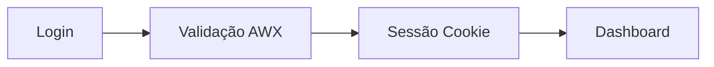
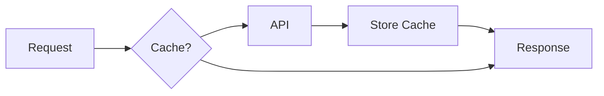

# Documentação Técnica - Cockpit AWX

## 📋 Índice da Documentação

Este diretório contém a documentação técnica completa da aplicação Cockpit de Automação AWX.

### 📄 Documentos Disponíveis

1. **[Diagramas de Sequência](./sequence-diagrams.md)**
   - Fluxos de autenticação
   - Carregamento do dashboard
   - Execução de job templates
   - Monitoramento em tempo real
   - Sistema de cache
   - Filtros e busca

2. **[Arquitetura da Aplicação](./architecture.md)**
   - Visão geral da arquitetura
   - Camadas da aplicação
   - Fluxo de dados
   - Estrutura de diretórios
   - Segurança e autenticação
   - Sistema de cache
   - Performance e otimizações

3. **[Documentação da API](./api-documentation.md)**
   - Endpoints AWX utilizados
   - Autenticação e autorização
   - Payloads e respostas
   - Tratamento de erros
   - Configurações de proxy
   - Performance e otimização

4. **[Guia de Desenvolvimento](./development-guide.md)**
   - Setup do ambiente
   - Estrutura do projeto
   - Design patterns utilizados
   - Sistema de testes
   - Build e deploy
   - Ferramentas de desenvolvimento

## 🎯 Propósito da Documentação

Esta documentação serve para:

- **Desenvolvedores**: Entender a arquitetura e contribuir com o projeto
- **DevOps**: Configurar deploy e monitoramento
- **QA**: Compreender fluxos para criação de testes
- **Arquitetos**: Avaliar decisões técnicas e padrões
- **Stakeholders**: Visualizar capacidades e limitações técnicas

## 🔄 Fluxos Principais Documentados

### 1. Autenticação

### 2. Execução de Automação

### 3. Cache e Performance

## 📊 Métricas e KPIs

### Performance
- **Time to Interactive**: < 2s
- **Bundle Size**: ~1.15MB
- **Cache Hit Rate**: > 80%
- **API Response Time**: < 500ms média

### Funcionalidades
- **150+ Job Templates** suportados
- **Multi-inventory** execution
- **Real-time monitoring** (3s polling)
- **Advanced filtering** (sistema + grupo + servidores)

## 🛠️ Stack Tecnológico

### Frontend
- **React 18** + TypeScript
- **Vite** (build tool)
- **Tailwind CSS** + shadcn/ui
- **React Router** (navegação)
- **ApexCharts** (visualização)

### Testing
- **Vitest** (test runner)
- **React Testing Library** (componentes)
- **jsdom** (DOM environment)

### Build & Deploy
- **Docker** (containerização)
- **Kubernetes** (orquestração)
- **nginx** (servidor web)

### External APIs
- **AWX/Ansible Tower** (automação)
- **Browser Storage** (cache local)

## 🔐 Considerações de Segurança

### Autenticação
- Basic Auth com AWX
- Session cookies (10min TTL)
- Credential rotation
- Auto-logout em inatividade

### Dados Sensíveis
- Credenciais nunca em localStorage permanente
- Headers de autenticação via cookies httpOnly
- Validação de sessão contínua
- Limpeza automática de dados expirados

### Network Security
- CORS configurado
- HTTPS enforced (produção)
- Proxy reverso para APIs
- Rate limiting interno

## 📈 Roadmap Técnico

### v1.1.0 (Próxima)
- [ ] Notificações push
- [ ] Tema escuro
- [ ] Exportação de relatórios
- [ ] Integração Slack/Teams

### v1.2.0 (Futuro)
- [ ] WebSocket para real-time
- [ ] Advanced caching (Redis)
- [ ] Micro-frontend architecture
- [ ] Progressive Web App (PWA)

### v2.0.0 (Longo prazo)
- [ ] Multi-tenant support
- [ ] Plugin system
- [ ] Advanced analytics
- [ ] Machine learning insights

## 🤝 Contribuição

### Como Contribuir
1. Leia a documentação técnica
2. Configure ambiente de desenvolvimento
3. Implemente feature/fix seguindo padrões
4. Adicione testes apropriados
5. Atualize documentação se necessário
6. Submeta pull request

### Padrões de Código
- TypeScript strict mode
- ESLint + Prettier
- Conventional commits
- Component composition over inheritance
- Custom hooks para lógica de negócio

### Review Process
- Code review obrigatório
- Testes automatizados passando
- Build de produção funcionando
- Performance impact avaliado
- Security implications consideradas

## 📞 Contato e Suporte

### Para Dúvidas Técnicas
- Consulte esta documentação primeiro
- Verifique issues existentes no repositório
- Crie nova issue com template apropriado

### Para Suporte de Produção
- Verifique logs da aplicação
- Teste conectividade com AWX
- Valide configurações de ambiente
- Consulte guia de troubleshooting

---

**Última atualização**: v1.0.1 - Dezembro 2024
**Mantenedor**: Equipe de Automação Crefisa
**Status**: Produção Ativa