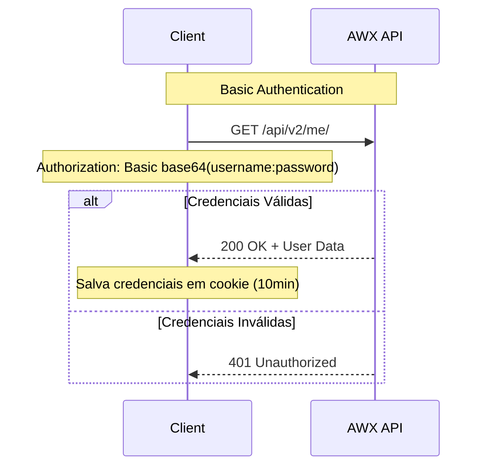

# Documentação da API - Cockpit AWX

Este documento detalha todas as interações da aplicação com a API do AWX/Ansible Tower, incluindo endpoints, payloads, respostas e tratamento de erros.

## 🚀 Visão Geral da API

A aplicação Cockpit AWX atua como um frontend moderno para a API REST do AWX/Ansible Tower, fornecendo uma interface amigável para execução e monitoramento de automações.

### Base URL e Configuração
```typescript
// Desenvolvimento (via proxy)
BASE_URL = "/api"

// Produção
BASE_URL = "${VITE_AWX_API}/api/v2"

// Headers padrão
DEFAULT_HEADERS = {
  'Content-Type': 'application/json',
  'Accept': 'application/json'
}
```

## 🔐 Autenticação

### Fluxo de Autenticação

```mermaid
sequenceDiagram
    participant Client
    participant AWX API
    
    Note over Client,AWX API: Basic Authentication
    
    Client->>AWX API: GET /api/v2/me/
    Note over Client: Authorization: Basic base64(username:password)
    
    alt Credenciais Válidas
        AWX API-->>Client: 200 OK + User Data
        Note over Client: Salva credenciais em cookie (10min)
    else Credenciais Inválidas
        AWX API-->>Client: 401 Unauthorized
    end
```

### Endpoint de Autenticação

#### `GET /api/v2/me/`
Valida credenciais e obtém informações do usuário atual.

**Headers:**
```http
Authorization: Basic <base64(username:password)>
Content-Type: application/json
```

**Resposta de Sucesso (200):**
```json
{
  "count": 1,
  "results": [
    {
      "id": 1,
      "username": "admin",
      "email": "admin@company.com",
      "first_name": "Admin",
      "last_name": "User",
      "is_superuser": true,
      "is_staff": true,
      "date_joined": "2023-01-01T00:00:00Z",
      "groups": {
        "count": 2,
        "results": [...]
      }
    }
  ]
}
```

**Erros Comuns:**
- `401`: Credenciais inválidas
- `403`: Usuário sem permissões adequadas
- `500`: Erro interno do AWX

## 📋 Job Templates

### Listagem de Templates

#### `GET /api/v2/job_templates/`
Obtém lista de todos os job templates disponíveis.

**Parâmetros Query:**
```typescript
interface JobTemplateParams {
  page?: number;
  page_size?: number;  // Padrão: 2000 (para obter todos)
  name?: string;       // Filtro por nome
  order_by?: string;   // Ordenação
}
```

**Exemplo de Requisição:**
```http
GET /api/v2/job_templates/?page_size=2000&order_by=name
Authorization: Basic <credentials>
```

**Resposta:**
```json
{
  "count": 150,
  "next": null,
  "previous": null,
  "results": [
    {
      "id": 7,
      "name": "SPI-WEB-Deploy",
      "description": "Deploy da aplicação SPI em servidores WEB",
      "job_type": "run",
      "inventory": 2,
      "project": 5,
      "playbook": "deploy.yml",
      "created": "2023-01-01T00:00:00Z",
      "modified": "2023-12-01T10:30:00Z",
      "last_job_run": "2023-12-15T14:22:00Z",
      "last_job_failed": false,
      "status": "successful",
      "summary_fields": {
        "inventory": {
          "id": 2,
          "name": "SPI-Production"
        },
        "project": {
          "id": 5,
          "name": "SPI-Automation"
        }
      }
    }
  ]
}
```

### Execução de Template

#### `POST /api/v2/job_templates/{id}/launch/`
Executa um job template específico com parâmetros opcionais.

**Payload:**
```json
{
  "inventory": 2,
  "limit": "spi-web-01,spi-web-02",
  "extra_vars": {
    "deploy_version": "1.2.3",
    "environment": "production"
  }
}
```

**Parâmetros do Payload:**
- `inventory` (required): ID do inventário a ser usado
- `limit` (optional): Limita execução a hosts específicos
- `extra_vars` (optional): Variáveis extras para o playbook

**Resposta de Sucesso (201):**
```json
{
  "id": 1234,
  "name": "SPI-WEB-Deploy #1234",
  "status": "pending",
  "created": "2023-12-15T14:30:00Z",
  "job_template": 7,
  "inventory": 2,
  "limit": "spi-web-01,spi-web-02",
  "extra_vars": "{\"deploy_version\": \"1.2.3\"}"
}
```

**Erros Comuns:**
- `400`: Parâmetros inválidos no payload
- `403`: Usuário sem permissão para executar o template
- `404`: Template não encontrado

## 🔍 Jobs e Monitoramento

### Listagem de Jobs

#### `GET /api/v2/jobs/`
Obtém lista de execuções de jobs.

**Parâmetros Query:**
```typescript
interface JobsParams {
  page?: number;
  page_size?: number;
  status?: 'new' | 'pending' | 'waiting' | 'running' | 'successful' | 'failed';
  order_by?: string;           // Ex: '-created' (mais recentes primeiro)
  created__gte?: string;       // Data início (YYYY-MM-DD)
  created__lte?: string;       // Data fim (YYYY-MM-DD)
  status__in?: string;         // Múltiplos status: 'running,pending,waiting'
}
```

**Exemplos de Uso:**

```http
# Jobs em execução
GET /api/v2/jobs/?status__in=running,pending,waiting&page_size=50

# Jobs dos últimos 30 dias
GET /api/v2/jobs/?created__gte=2023-11-15&order_by=-created&page_size=100

# Jobs com falha
GET /api/v2/jobs/?status=failed&page_size=20
```

**Resposta:**
```json
{
  "count": 45,
  "results": [
    {
      "id": 1234,
      "name": "SPI-WEB-Deploy #1234",
      "status": "running",
      "created": "2023-12-15T14:30:00Z",
      "started": "2023-12-15T14:30:15Z",
      "finished": null,
      "elapsed": 120.5,
      "job_template": 7,
      "job_template_name": "SPI-WEB-Deploy",
      "inventory": 2,
      "inventory_name": "SPI-Production",
      "failed": false,
      "limit": "spi-web-01,spi-web-02"
    }
  ]
}
```

### Detalhes de Job Específico

#### `GET /api/v2/jobs/{id}/`
Obtém detalhes completos de um job específico.

**Resposta:**
```json
{
  "id": 1234,
  "name": "SPI-WEB-Deploy #1234",
  "description": "",
  "status": "successful",
  "created": "2023-12-15T14:30:00Z",
  "started": "2023-12-15T14:30:15Z",
  "finished": "2023-12-15T14:35:42Z",
  "elapsed": 327.8,
  "job_template": 7,
  "job_template_name": "SPI-WEB-Deploy",
  "inventory": 2,
  "inventory_name": "SPI-Production",
  "project": 5,
  "project_name": "SPI-Automation",
  "playbook": "deploy.yml",
  "failed": false,
  "limit": "spi-web-01,spi-web-02",
  "extra_vars": "{\"deploy_version\": \"1.2.3\"}",
  "artifacts": {},
  "result_traceback": ""
}
```

### Logs de Execução

#### `GET /api/v2/jobs/{id}/stdout/`
Obtém os logs de saída completos de um job.

**Resposta (text/plain):**
```
PLAY [Deploy SPI Application] **************************************************

TASK [Gathering Facts] *********************************************************
ok: [spi-web-01]
ok: [spi-web-02]

TASK [Stop application service] ***********************************************
changed: [spi-web-01]
changed: [spi-web-02]

TASK [Deploy new version] ******************************************************
changed: [spi-web-01]
changed: [spi-web-02]

PLAY RECAP *********************************************************************
spi-web-01                 : ok=3    changed=2    unreachable=0    failed=0
spi-web-02                 : ok=3    changed=2    unreachable=0    failed=0
```

## 📦 Inventários e Hosts

### Listagem de Inventários

#### `GET /api/v2/inventories/`
Obtém lista de inventários disponíveis.

**Resposta:**
```json
{
  "count": 8,
  "results": [
    {
      "id": 2,
      "name": "SPI-Production",
      "description": "Inventário de produção do SPI",
      "created": "2023-01-01T00:00:00Z",
      "modified": "2023-12-01T10:00:00Z",
      "hosts": 25,
      "groups": 5,
      "summary_fields": {
        "organization": {
          "id": 1,
          "name": "Default"
        }
      }
    }
  ]
}
```

### Hosts por Grupo

#### `GET /api/v2/inventories/{id}/hosts/`
Obtém hosts de um inventário, com filtragem opcional por grupo.

**Parâmetros Query:**
```typescript
interface HostsParams {
  groups__name?: string;    // Filtrar por nome do grupo
  page_size?: number;
}
```

**Exemplo:**
```http
GET /api/v2/inventories/2/hosts/?groups__name=WEB&page_size=100
```

**Resposta:**
```json
{
  "count": 4,
  "results": [
    {
      "id": 15,
      "name": "spi-web-01",
      "description": "Servidor web SPI #1",
      "enabled": true,
      "variables": {
        "ansible_host": "192.168.1.10",
        "server_role": "web"
      },
      "groups": {
        "count": 2,
        "results": [
          {"id": 5, "name": "WEB"},
          {"id": 8, "name": "SPI"}
        ]
      }
    }
  ]
}
```

## 📊 Estatísticas e Métricas

### Dashboard do AWX

#### `GET /api/v2/dashboard/`
Obtém estatísticas gerais do dashboard (limitado no AWX).

**Nota:** Este endpoint pode ter funcionalidade limitada. A aplicação calcula suas próprias estatísticas usando agregações dos jobs.

### Métricas Calculadas pela Aplicação

A aplicação calcula métricas próprias usando múltiplas chamadas:

```typescript
// Estatísticas dos últimos 12 meses
const stats = {
  totalExecutions: await getJobs({ created__gte: '12-months-ago' }),
  successfulExecutions: await getJobs({ 
    created__gte: '12-months-ago', 
    status: 'successful' 
  }),
  failedExecutions: await getJobs({ 
    created__gte: '12-months-ago', 
    status: 'failed' 
  }),
  runningExecutions: await getJobs({ 
    status__in: 'running,pending,waiting' 
  })
};
```

## 🚨 Tratamento de Erros

### Códigos de Status HTTP

| Código | Descrição | Ação da Aplicação |
|--------|-----------|-------------------|
| 200 | Sucesso | Processa dados normalmente |
| 201 | Criado | Job executado com sucesso |
| 400 | Bad Request | Mostra erro de validação |
| 401 | Unauthorized | Redireciona para login |
| 403 | Forbidden | Mostra erro de permissão |
| 404 | Not Found | Mostra erro de recurso não encontrado |
| 500 | Server Error | Mostra erro interno do AWX |
| 504 | Timeout | Mostra erro de timeout |

### Exemplos de Respostas de Erro

**401 Unauthorized:**
```json
{
  "detail": "Invalid username/password."
}
```

**403 Forbidden:**
```json
{
  "detail": "You do not have permission to perform this action."
}
```

**400 Bad Request (Execução de Job):**
```json
{
  "inventory": ["This field is required."],
  "extra_vars": ["Must be valid JSON."]
}
```

**500 Server Error:**
```json
{
  "detail": "Internal server error occurred."
}
```

## 🔄 Padrões de Integração

### Rate Limiting
A aplicação implementa controles internos para evitar sobrecarga:
- Debounce em buscas (300ms)
- Throttling em polling (3s para jobs ativos)
- Cache com TTL para reduzir chamadas desnecessárias

### Retry Strategy
```typescript
// Estratégia de retry para requisições críticas
const retryConfig = {
  attempts: 3,
  delay: 1000, // 1s
  backoff: 'exponential',
  retryCondition: (error) => {
    return error.status >= 500 || error.status === 429;
  }
};
```

### Timeout Management
```typescript
// Timeout configurável por tipo de operação
const TIMEOUTS = {
  authentication: 10000,    // 10s
  jobExecution: 30000,     // 30s
  dataFetching: 15000,     // 15s
  polling: 5000            // 5s
};
```

## 🔧 Configuração de Proxy (Desenvolvimento)

### Vite Proxy Config
```typescript
// vite.config.ts
export default defineConfig({
  server: {
    proxy: {
      '/api': {
        target: process.env.VITE_AWX_API,
        changeOrigin: true,
        secure: false,
        rewrite: (path) => path.replace(/^\/api/, '/api/v2')
      }
    }
  }
});
```

### CORS Headers
Para produção, configure os headers CORS no AWX:
```
Access-Control-Allow-Origin: https://your-app-domain.com
Access-Control-Allow-Methods: GET, POST, PUT, DELETE, OPTIONS
Access-Control-Allow-Headers: Content-Type, Authorization
Access-Control-Max-Age: 86400
```

## 📈 Performance e Otimização

### Pagination Strategy
```typescript
// Busca otimizada com page_size adequado
const OPTIMAL_PAGE_SIZES = {
  jobTemplates: 2000,    // Busca todos (relativamente poucos)
  jobs: 200,             // Limitado por performance
  hosts: 100,            // Limitado por UI
  inventories: 50        // Geralmente poucos
};
```

### Caching Strategy
```typescript
// Cache por tipo de dados
const CACHE_CONFIGS = {
  jobTemplates: { ttl: 300000 },      // 5min (mudam pouco)
  dashboardStats: { ttl: 300000 },   // 5min (atualizadas frequentemente)
  inventories: { ttl: 900000 },      // 15min (mudam raramente)
  runningJobs: { ttl: 10000 }        // 10s (tempo real)
};
```

### Request Batching
```typescript
// Agrupa requisições relacionadas
const batchRequests = async () => {
  const [templates, inventories, stats] = await Promise.all([
    getJobTemplates(),
    getInventories(), 
    getDashboardStats()
  ]);
  
  return { templates, inventories, stats };
};
```

## 🔍 Debug e Monitoramento

### Request Logging
```typescript
// Log estruturado para debug
const logRequest = (method: string, url: string, duration: number) => {
  console.log(`🌐 ${method} ${url} - ${duration}ms`);
};
```

### Error Tracking
```typescript
// Tracking de erros por endpoint
const errorStats = {
  '/api/v2/jobs/': { count: 2, lastError: '401' },
  '/api/v2/job_templates/': { count: 0 },
  '/api/v2/inventories/': { count: 1, lastError: '500' }
};
```

### Health Check Endpoint
```typescript
// Verificação de conectividade
const healthCheck = async () => {
  try {
    const response = await fetch('/api/v2/ping/', { timeout: 5000 });
    return { status: 'healthy', latency: response.time };
  } catch (error) {
    return { status: 'unhealthy', error: error.message };
  }
};
```