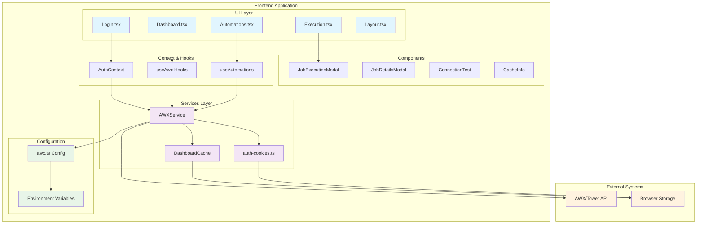
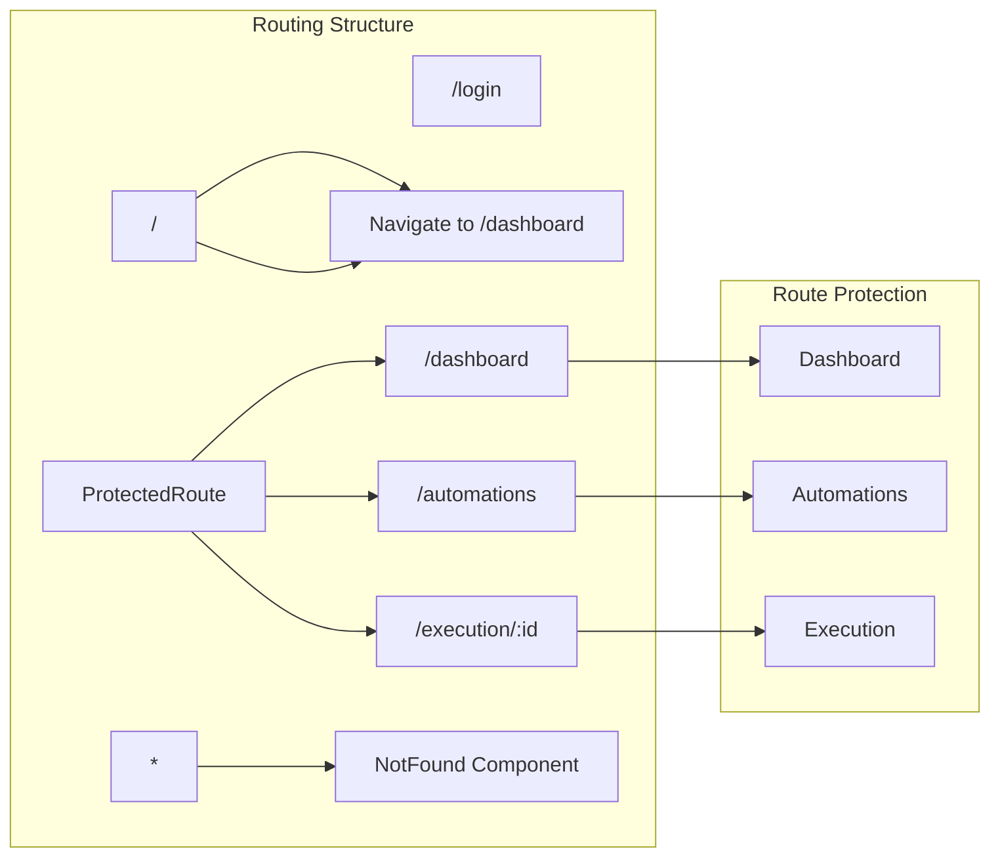
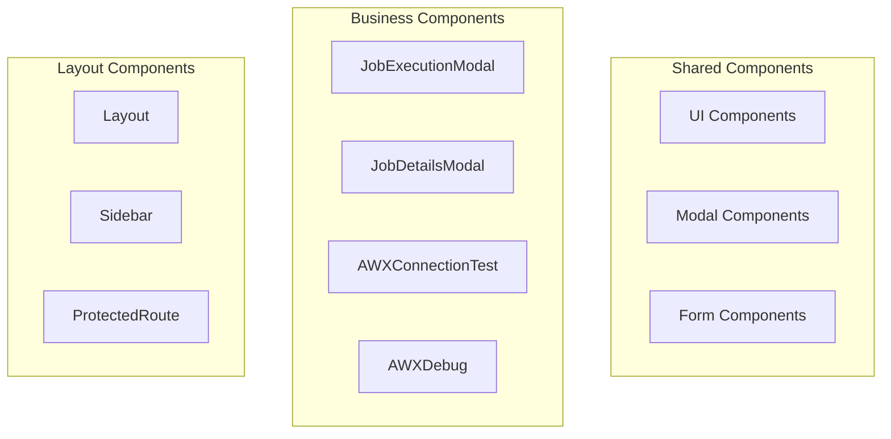
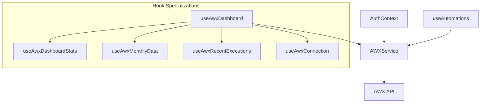
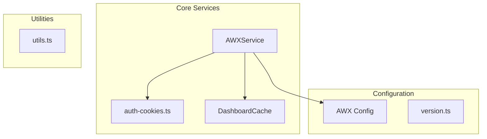
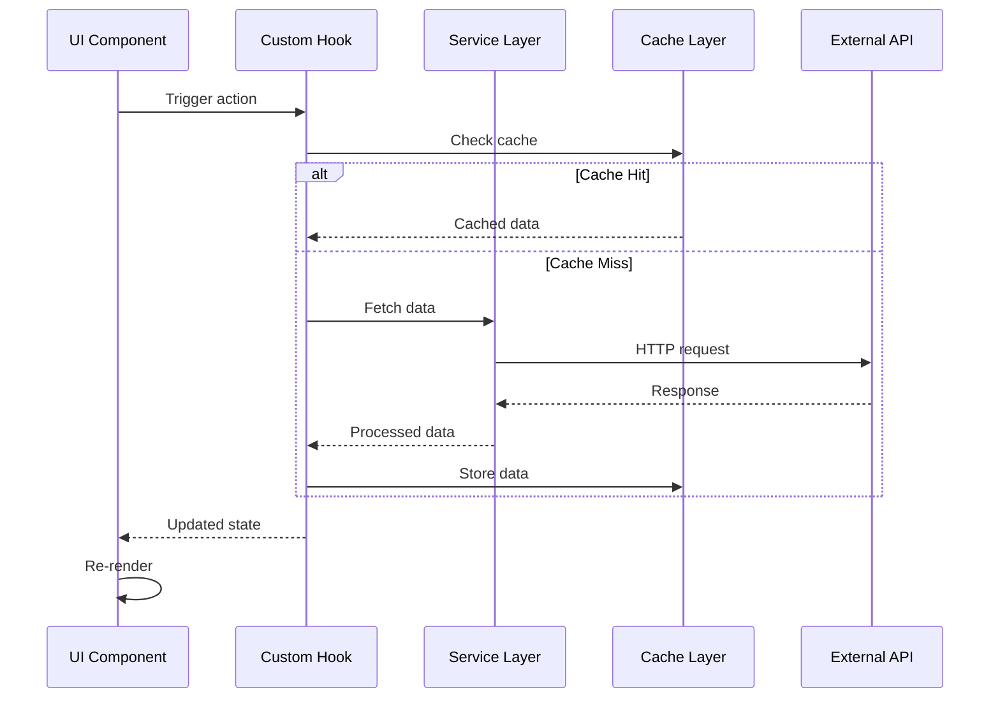
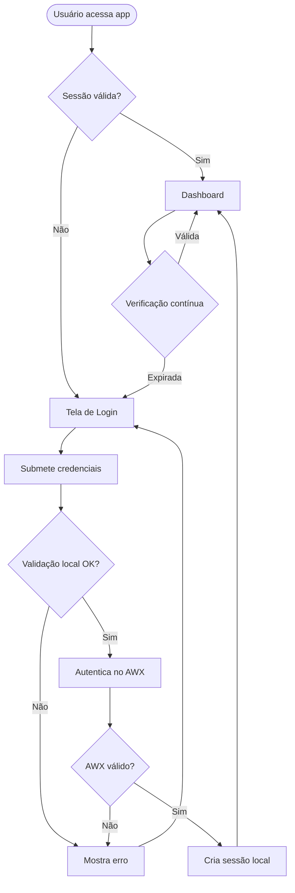
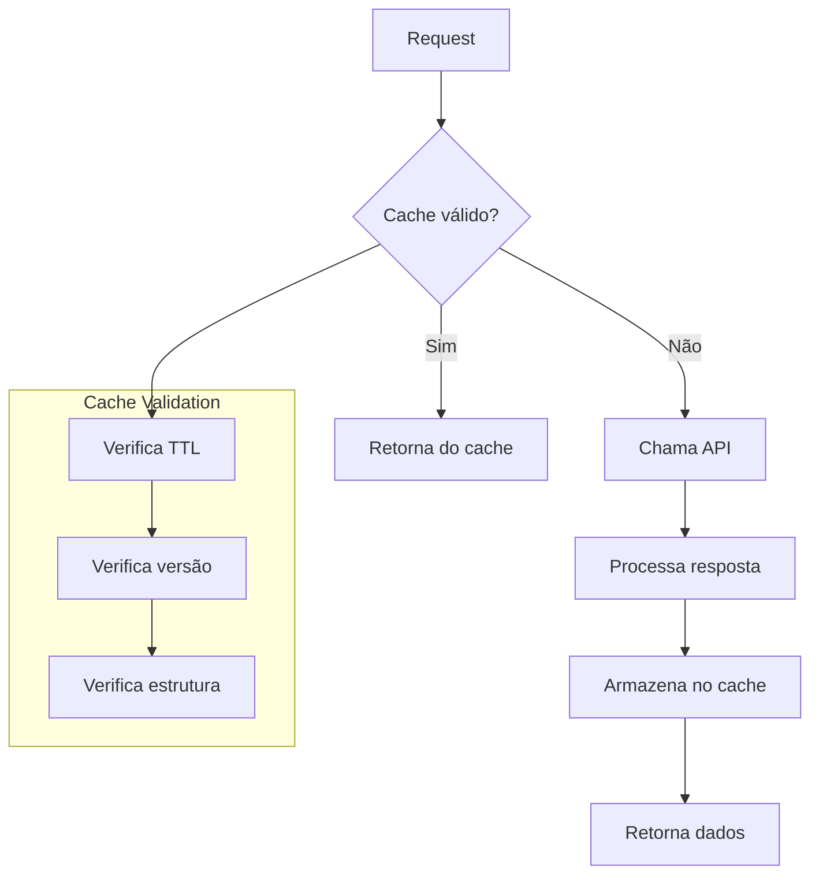
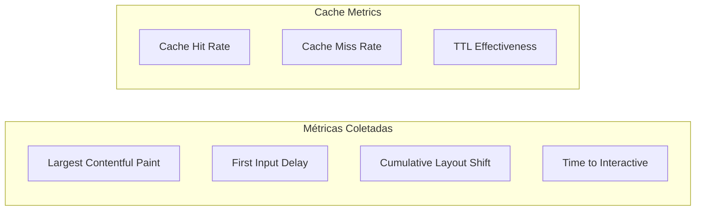
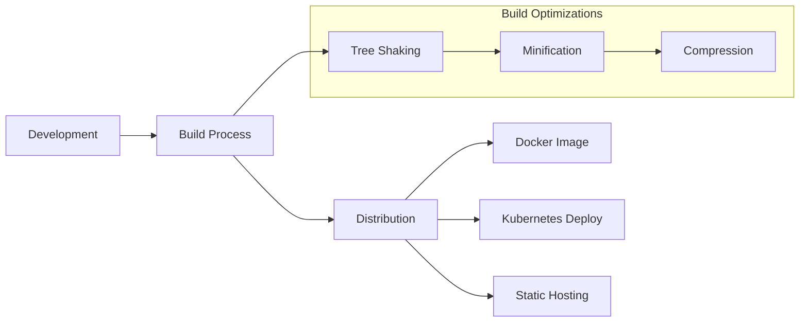

# Arquitetura da Aplicação - Cockpit AWX

Este documento descreve a arquitetura geral da aplicação de automação AWX, incluindo componentes, camadas e fluxos de dados.

## 📐 Visão Geral da Arquitetura



## 🏗️ Camadas da Aplicação

### 1. UI Layer (Páginas Principais)
Componentes de interface que representam as rotas principais da aplicação.



**Páginas Implementadas:**
- **Login.tsx**: Tela de autenticação com credenciais AWX
- **Dashboard.tsx**: Métricas, estatísticas e visão geral das execuções
- **Automations.tsx**: Lista e execução de job templates
- **Execution.tsx**: Detalhes de execução específica (rota com parâmetro :id)
- **NotFound.tsx**: Página 404 para rotas não encontradas

**Responsabilidades:**
- Renderização de interfaces
- Gerenciamento de estado local (formulários, modais)
- Orquestração de hooks e contexts
- Navegação entre rotas protegidas

### 2. Components Layer
Componentes reutilizáveis e especializados.



### 3. Context & Hooks Layer
Gerenciamento de estado global e lógica de negócio.



### 4. Services Layer
Camada de serviços e utilitários.



## 🔄 Fluxo de Dados

### Padrão de Comunicação
A aplicação segue um padrão de fluxo unidirecional:



## 🛡️ Sistema de Roteamento

### Estrutura Real das Rotas
```typescript
// src/App.tsx - Configuração atual das rotas
<Routes>
  <Route path="/login" element={<Login />} />
  
  {/* Rota raiz redireciona para dashboard */}
  <Route path="/" element={
    <ProtectedRoute>
      <Navigate to="/dashboard" replace />
    </ProtectedRoute>
  } />
  
  {/* Rotas protegidas */}
  <Route path="/dashboard" element={
    <ProtectedRoute><Dashboard /></ProtectedRoute>
  } />
  
  <Route path="/automations" element={
    <ProtectedRoute><Automations /></ProtectedRoute>
  } />
  
  <Route path="/execution/:id" element={
    <ProtectedRoute><Execution /></ProtectedRoute>
  } />
  
  {/* Catch-all para 404 */}
  <Route path="*" element={<NotFound />} />
</Routes>
```

### Proteção de Rotas
- **ProtectedRoute**: Verifica autenticação antes de renderizar
- **Navigate**: Redireciona usuários autenticados de "/" para "/dashboard"
- **404 Handler**: Captura todas as rotas não encontradas

## 🗂️ Estrutura de Diretórios

```
src/
├── components/          # Componentes reutilizáveis
│   ├── ui/             # Componentes base do design system
│   └── *.tsx           # Componentes de negócio
├── contexts/           # Context providers
├── hooks/              # Custom hooks
├── pages/              # Componentes de página (5 páginas)
├── services/           # Camada de serviços
├── lib/                # Utilitários e helpers
├── config/             # Configurações
└── integrations/       # Integrações externas
```

## 🔐 Segurança e Autenticação

### Fluxo de Autenticação


### Mecanismos de Segurança
- **Basic Authentication**: Credenciais enviadas via header Authorization
- **Session Management**: Cookies com expiração de 10 minutos
- **Auto-renewal**: Verificação contínua de sessão válida
- **Credential Storage**: Armazenamento seguro em localStorage/sessionStorage
- **Route Protection**: ProtectedRoute component para rotas autenticadas

## 💾 Sistema de Cache

### Estratégia de Cache


### Tipos de Cache
| Tipo | TTL | Uso |
|------|-----|-----|
| Dashboard Stats | 5 min | Estatísticas gerais |
| Monthly Data | 60 min | Dados históricos mensais |
| Recent Executions | 2 min | Execuções recentes |

## 🚀 Performance e Otimizações

### Otimizações Implementadas
- **Code Splitting**: Lazy loading de rotas
- **Memoization**: React.memo e useMemo em componentes críticos
- **Debounced Search**: Busca com delay para evitar requisições excessivas
- **Pagination**: Controle de quantidade de dados por requisição
- **Cache Inteligente**: TTL diferenciado por tipo de dados
- **Bundle Optimization**: Tree shaking e chunk splitting

### Monitoramento de Performance


## 🔧 Configurações por Ambiente

### Variáveis de Ambiente
```typescript
// Desenvolvimento
VITE_AWX_API=/api (proxy)
VITE_CACHE_VERSION=1.0.1
VITE_TEST_USERNAME=test_user
VITE_TEST_PASSWORD=test_pass

// Produção  
VITE_AWX_API=https://awx.company.com/api/v2
VITE_CACHE_VERSION=1.0.1
// Sem variáveis de teste
```

### Build e Deploy


## 📊 Monitoramento e Observabilidade

### Logs Estruturados
```javascript
// Padrão de logs da aplicação
console.log('🔐 Login successful:', { username, timestamp });
console.log('📊 Cache hit:', { type: 'dashboardStats', age: '2min' });
console.log('🚀 Job execution started:', { templateId, jobId });
console.error('❌ API Error:', { endpoint, status, error });
```

### Health Checks
- Conectividade com AWX API
- Validade da sessão do usuário  
- Status do cache (hit rate, expiração)
- Performance de requisições

### Métricas de Negócio
- Taxa de sucesso de execuções
- Tempo médio de execução
- Templates mais utilizados
- Usuários mais ativos

## 🔮 Extensibilidade

### Pontos de Extensão
1. **Novos Providers**: Suporte a outras ferramentas além do AWX
2. **Plugin System**: Extensões para funcionalidades específicas
3. **Custom Hooks**: Hooks especializados para novos casos de uso
4. **Theme System**: Personalização visual por empresa/departamento
5. **Notification System**: Integração com Slack, Teams, email

### Padrões Arquiteturais
- **Dependency Injection**: Services podem ser substituídos
- **Observer Pattern**: Hooks reagentes a mudanças de estado
- **Strategy Pattern**: Diferentes estratégias de cache/autenticação
- **Factory Pattern**: Criação dinâmica de componentes por contexto