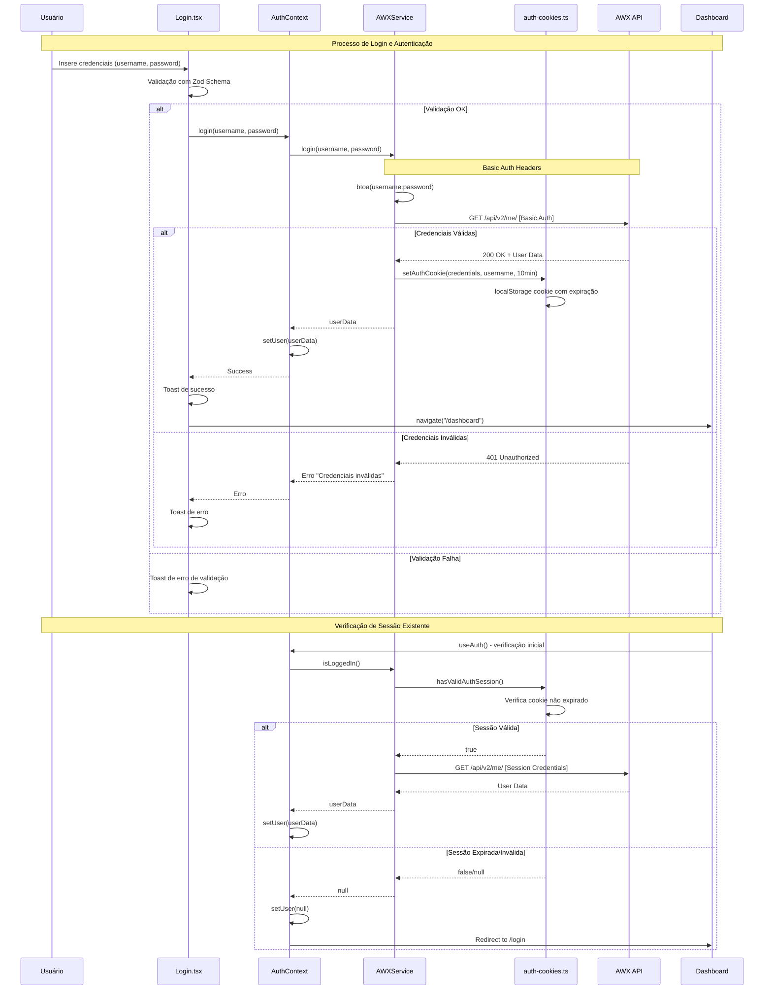
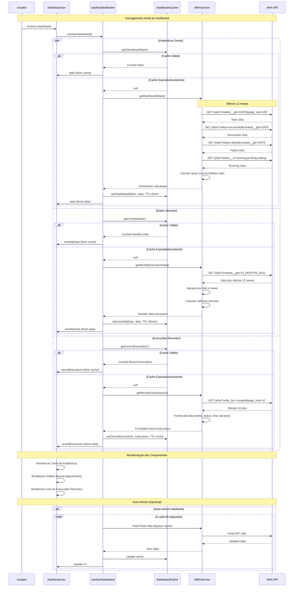
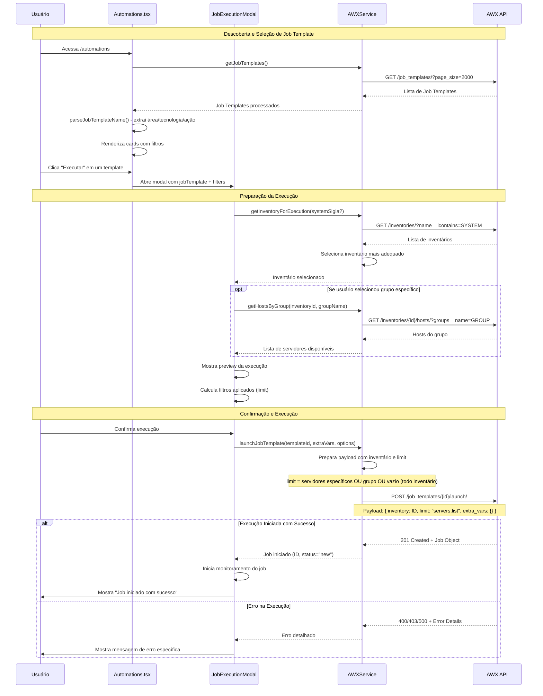
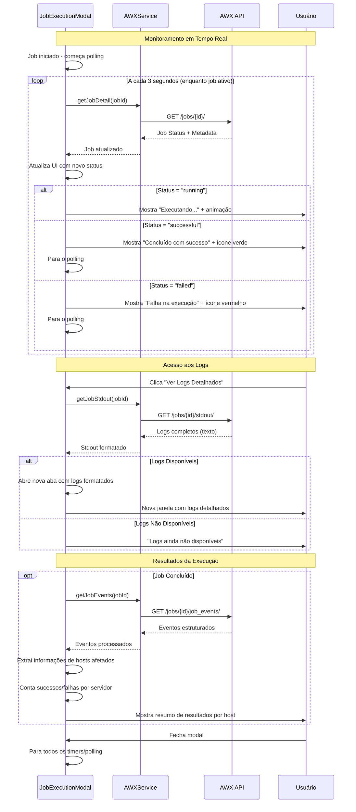
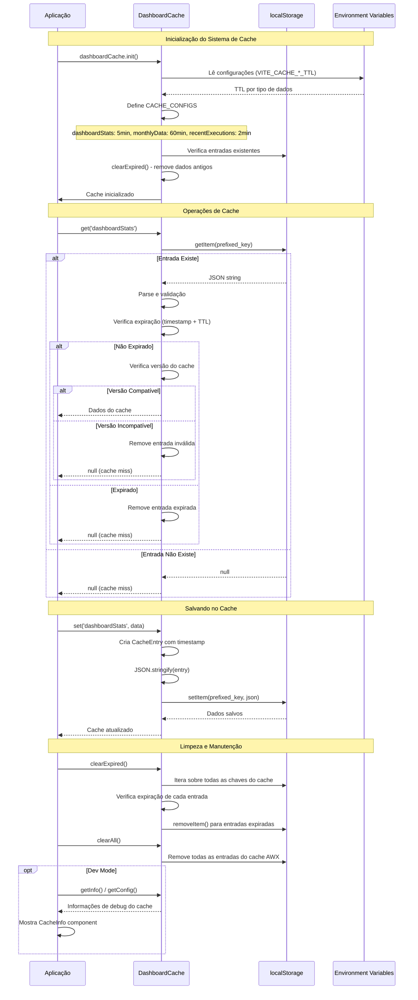
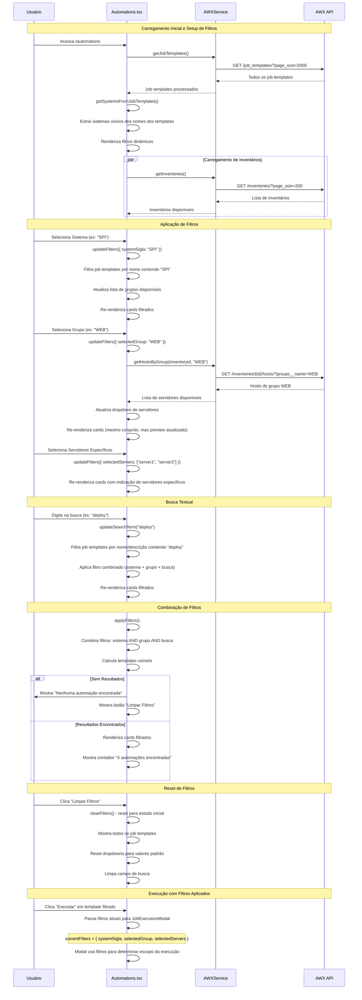

# Diagramas de Sequência - Cockpit de Automação AWX

Este documento contém os diagramas de sequência que descrevem os principais fluxos da aplicação de automação AWX.

## 📋 Índice

1. [Fluxo de Autenticação](#1-fluxo-de-autenticação)
2. [Carregamento do Dashboard](#2-carregamento-do-dashboard)
3. [Execução de Job Template](#3-execução-de-job-template)
4. [Monitoramento de Execução](#4-monitoramento-de-execução)
5. [Sistema de Cache](#5-sistema-de-cache)
6. [Filtros e Busca de Automações](#6-filtros-e-busca-de-automações)

---

## 1. Fluxo de Autenticação

---

## 2. Carregamento do Dashboard

---

## 3. Execução de Job Template

---

## 4. Monitoramento de Execução

---

## 5. Sistema de Cache

---

## 6. Filtros e Busca de Automações

---

## 🔧 Configurações e Variáveis

### Variáveis de Cache
- `VITE_CACHE_DASHBOARD_STATS_TTL`: TTL para estatísticas (padrão: 5min)
- `VITE_CACHE_MONTHLY_DATA_TTL`: TTL para dados mensais (padrão: 60min)  
- `VITE_CACHE_RECENT_EXECUTIONS_TTL`: TTL para execuções recentes (padrão: 2min)
- `VITE_CACHE_VERSION`: Versão do cache para invalidação

### Timeouts e Intervalos
- **Timeout de Requisições**: 30 segundos
- **Polling de Jobs**: 3 segundos
- **Auto-refresh Dashboard**: 60 segundos
- **Expiração de Sessão**: 10 minutos

### Endpoints AWX Utilizados
- `/api/v2/me/` - Autenticação e dados do usuário
- `/api/v2/job_templates/` - Lista de automações
- `/api/v2/jobs/` - Execuções e monitoramento
- `/api/v2/inventories/` - Inventários e hosts
- `/api/v2/job_templates/{id}/launch/` - Execução de automações

---

## 📊 Fluxos de Dados

### Estados de Job
1. **new** → **pending** → **waiting** → **running** → **successful/failed**
2. Polling contínuo durante estados ativos (new, pending, waiting, running)
3. Logs disponíveis apenas após início da execução (running+)

### Cache Strategy
1. **Cache-first**: Verifica cache antes de API
2. **TTL-based**: Expiração automática por tipo de dados
3. **Version-aware**: Invalida cache em mudanças de versão
4. **Manual override**: Force refresh bypassa cache

### Autenticação
1. **Session-based**: Cookies com expiração de 10min
2. **Auto-renewal**: Verificação contínua de sessão válida
3. **Fallback storage**: sessionStorage como backup
4. **Credential rotation**: Limpeza automática de credenciais inválidas